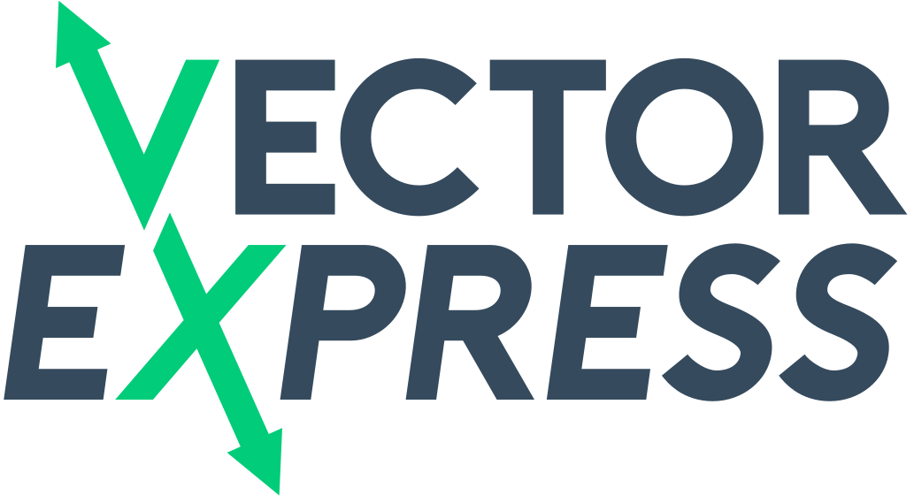

# Vector Express - Free Vector Converting API

http://vector.express

Vector Express is a free website and API for converting vector files. Made with love by [@Smidyo](https://twitter.com/smidyo)

Runs a combination of Inkscape, SVGO and a custom made DXF (and soon DWG) converter under the hood.

## API

You can use our free API in your projects.

Useage is simple, just provide your file in the form field `file` and your desired extension in the querystring `toextension` The API will return a file.

Examples:

POST `vector.express/api/public/vectorconvert?toextension=optimizedsvg`

POST `vector.express/api/public/vectorconvert?toextension=svg`

POST `vector.express/api/public/vectorconvert?toextension=eps`

POST `vector.express/api/public/vectorconvert?toextension=pdf`

### Limits

Max filesize is 10MB and the hourly limit is 20 files. We reserve the right to change this at any point.

### Supported formats

At the moment we can convert from these formats:

- svg
- pdf
- ai
- cdr
- eps
- ps
- hpgl
- dxf
- plt
- (dwg coming soon)

..to these formats

- svg
- optimizedsvg (svg that is optimized with SVGO)
- eps
- pdf

## Feedback

Feel free to open up an issue, or just tweet at us. Or mail us! smidyo@cnc-design.fi  
